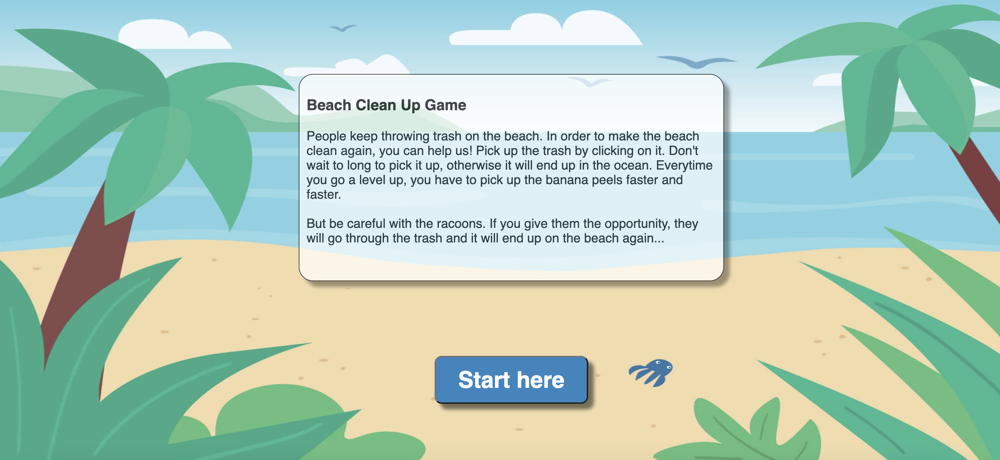
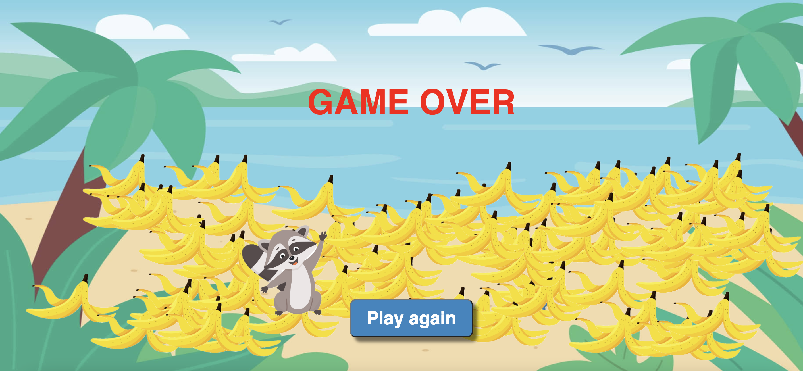

# PROJECT 1 | Beach Clean Up Game

## Introduction
This game is developed for project 1 of the Web Development Ironhack Bootcamp (cohort October 2023). The game is developed with HTML, CSS and JavaScript (including DOM manipulation). 

## Game overview and instructions
The game starts at the Start Page. There's a short introduction and explanation about the game. In order to start the game, the player can click on 'Start here'.

The goal of the game is to keep the beach clean. A banana peel will appear on a random place on the screen and it will be visible for 2 seconds. You have to click on the banana peels in order to clean them up, which adds 1 point to the scoreboard (trash can). Every 10 seconds the player will go one level up, which means the computer will create banana peel faster. These are the different levels and corresponding times:
- Level 0: every 3 seconds a banana peel appears
- Level 1: every 2 seconds a banana peel appears
- Level 2: every second a banana peel appears
- From level 3 the seconds go down by 0.1 every level

Besides the banana peels, the computer also creates racoons. The racoons also appear on a random place on the screen. The computer creates the racoon in a time randomly between 1 and 15 seconds. The player shouldn't click on the racoon because the racoon goes into the trash can and spreads the trash. 

Game over:
- If the player doesn't click on the banana peel within 2 seconds, it's game over
- If the player clicks on the racoon, it's game over 

When the player is game over, he will be redirected to the game over page. The play can click on the 'Play again' botton to start a new game.

## Demo
Visit the following URL to play the game: https://elisejonkers.github.io/game-module1/. There is no installation needed.

## Known issues/future improvements
- The objects appear on a random place at the screen. The computer doesn't take the current object into account, so objects can overlap each other
- The final score and level are not visible anymore as soon as the player is game over
- The addition of a high score and sound effects can improve the user experience of the game

